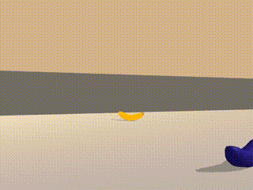

# Navigation Project Jonas Schmidt

Welcome to the Banana Navigation Project.  
In this Project we train an agent to collect Yellow Bananas and avoid Blue Bananas.  
👇🏼This is the resulting agent 

## Project Details

This project contains a solution to the first project of Udacity Deep Reinforcement Learning. This Project uses a DQN
Algorithm to train the agent.

A reward of 1 is provided for collecting a yellow banana, and a reward of -1 is provided for collecting a blue banana.
Therefore the goal is to collect as many yellow bananas as possible and avoid blue bananas.

### State and Action Spaces

The state space consists of 37 dimensions of ray based perception in the forward direction.

The action space consists of 4 discrete actions:

- 0 -> move forward
- 1 -> move backward
- 2 -> turn left
- 3 -> turn right

The Agent decides on these actions using an epsilon greedy policy.  
The preferred action is determined by the highest of
the four output nodes of the model.

The task is episodic, and in order to solve the environment, your agent must get an average score of +13 over 100 consecutive episodes.

Check the following link for more details:  
<https://github.com/udacity/deep-reinforcement-learning/tree/master/p1_navigation>

## Getting Started

###Prerequisites
Python 3.6
Unity

##Installation:
pip install -r requirements.txt

Then you should be able to run jupyter notebook and view Navigation.ipyb.

